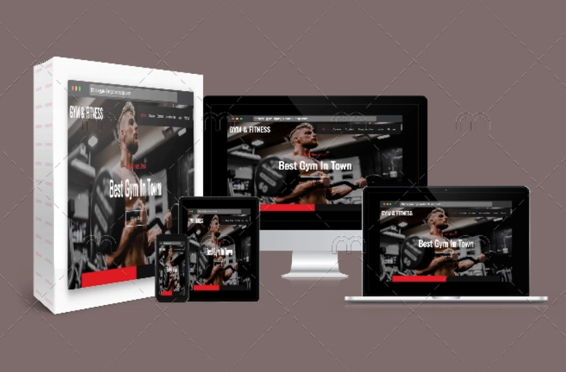
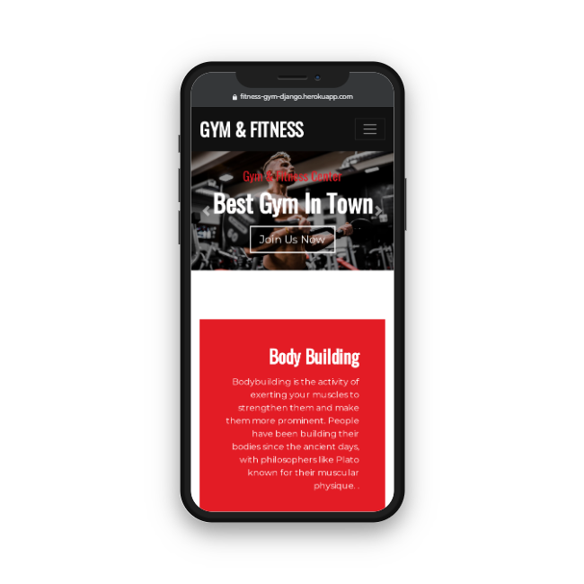
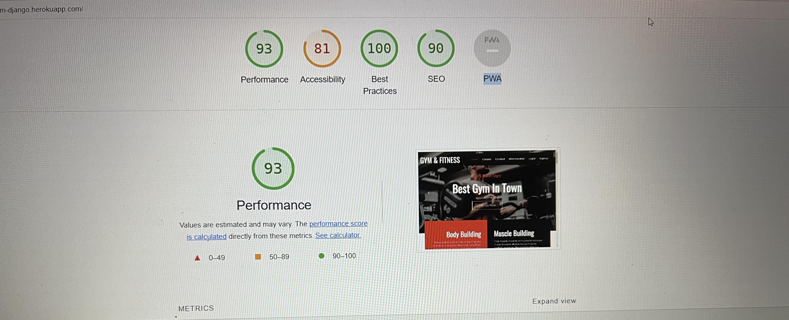
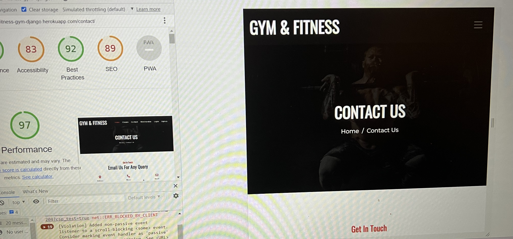
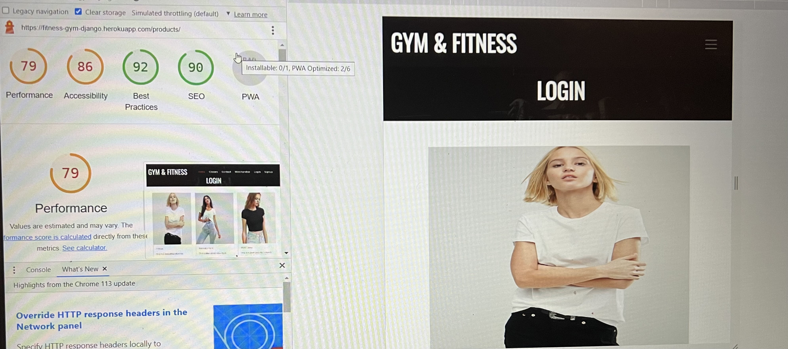
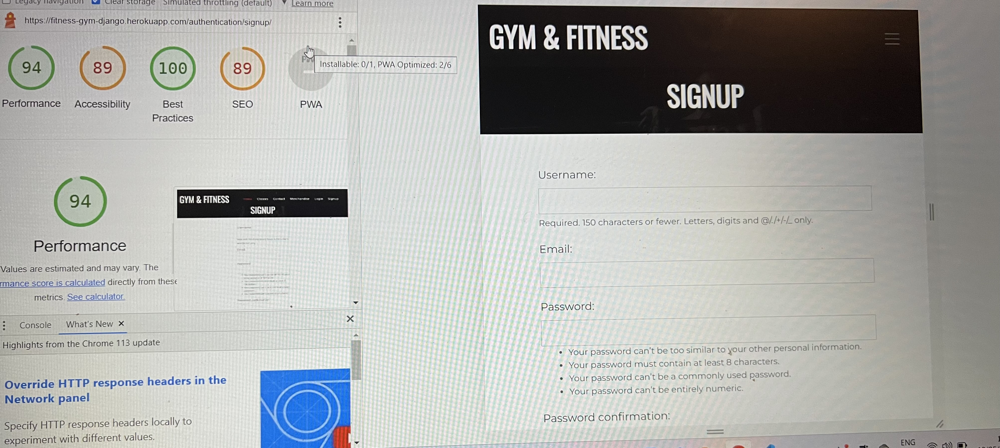
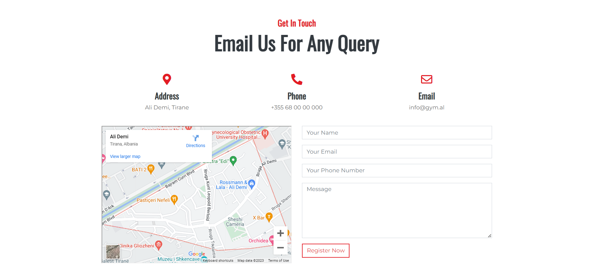

# Fitness Gym Django Application



Welcome to the Fitness Gym Django App! This application is designed to help users manage their fitness goals and schedules.

## Table of Contents
* [Purpose](#purpose)
* [User Experience](#user-Experience)
    * [User Stories](#user-Stories)
    * [Design](#design)
        * [Color Scheme](#color-Scheme)
        * [Typography](#typography)
        * [Imagery](#imagery)
        * [Wireframes](#wireframes)
    * [Features](#features)
    * [Accessibility](#accessibility)
* [Technologies Used](#technologies-Used)
    * [Languages Used](#languages-Used)
    * [Frameworks and Libraries Used](#frameworks-and-Libraries-Used)
* [Testing](#testing)
    * [Validation](#validation)
    * [Fixed Bugs](#fixed-Bugs)
    * [Known Issues](#known-Issues)
    * [Testing User Stories](#Testing-User-Stories)
    * [Lighthouse](#Lighthouse)
        * [Home Page](#Home-Page)
        * [Class Time](#class-time)
        * [Merchandise](#merchandise)
    * [Manual Testing](#Manual-Testing)
* [Deployment & Local Development](#Deployment-&-Local-Development)
    * [Deploying to Heroku](#Deploying-to-Heroku)
    * [Local Development](#Local-Development)
        * [How to Fork](#How-to-Fork)

## Purpose
This is a Django web application for managing fitness activities at a gym. The app allows gym members to create accounts, track their workouts, and monitor their progress over time. Gym managers can use the app to manage memberships, create workout plans, and track gym statistics.

## User Experience
## User Stories
- First Time Visitor Goals
    - As a first time visitor, I want to be able to navigate the site easily.
    - As a first time visitor, I want to sign up and create a new account.
    - As a first time visitor, I want to view the available membership plans.
    - As a first time visitor, I want to view the gym schedule.
    - As a first time visitor, I want to learn more about the gym and their facilities.
- Returning Visitor Goals
    - As a returning visitor, I want to log in to my account.
    - As a returning visitor, I want to view and update my profile information.
    - As a returning visitor, I want to renew or cancel my membership plan.
    - As a returning visitor, I want to view my previous gym schedules and workouts.
- Frequent Visitor Goals
    - As a frequent visitor, I want to book a session in the gym.
    - As a frequent visitor, I want to receive notifications of upcoming gym sessions.
    - As a frequent visitor, I want to view the instructor details and availability.

## Design
The project's documentation describes the UX design work undertaken for this project and the reasoning behind it.

The UX design was focused on creating an intuitive and user-friendly experience for gym members and managers. The app features a clean and modern design that is easy to navigate, with clear calls to action and a consistent layout throughout.

The user interface was designed to be responsive and mobile-friendly, with a layout that adapts to different screen sizes and resolutions. This allows gym members to easily track their workouts and monitor their progress on their mobile devices.

The app also features a number of interactive and visual elements to enhance the user experience. For example, workout tracking includes a progress bar that shows the user's progress towards their goal, and workout plans include images and descriptions of each exercise.

Overall, the UX design was informed by user research and feedback, with a focus on creating a user-friendly and engaging experience for gym members and managers.

- `Color Scheme` - The color scheme for this application is Black, white and Orange.

- `Typography` -
The primary font used in this application is Open Sans.

- `Imagery` -
Images used in this application are primarily related to fitness and exercise.

- `Wireframes` -
Wireframes for this project have been worked using figma
Can find wireframes in two ways,through the link or visiting the images below.
* [wireframe desktop and mobile](document/wireframe%20(1).png)


https://www.figma.com/file/XeOVdO59OqkKdInDLbTwb1/gym-wireframe?type=design&node-id=12%3A397&t=GfcAabvtg0gGbgXC-1

## Features

- User authentication: Gym members can create accounts and log in to track their workouts.
- Workout tracking: Members can create and track their workouts, including exercises, sets, and reps.
- Progress monitoring: Members can view their workout history and monitor their progress over time.
- Membership management: Gym managers can manage memberships, including adding and removing members and setting membership expiration dates.
- Workout planning: Gym managers can create workout plans and assign them to members.
- Statistics tracking: Gym managers can view statistics such as the number of members, most popular workouts, and overall gym attendance.

## Accessibility
This application has been designed with accessibility in mind, and includes appropriate labeling and alt text for images.


## Technologies Used
 - Languages Used
    * Python
    * HTML
    * CSS
    * JavaScript
 - Frameworks and Libraries Used
    * Django
    * Bootstrap
    * jQuery
## Testing
 - `Validation` -
This application has been validated using the W3C Markup Validation Service.
* [HTML validation](document/html.check.png)
* [CSS validation](document/css.check.png)

## Fixed Bugs
* No major bugs were encountered during development.

## Known Issues
* No known issues exist at this time.

## Testing User Stories
All user stories have been tested and validated.
-Desktop device

-Mobile devicde


## Lighthouse
- Home Page

- Contact

- Login

-Signup


## Deployment & Local Development
* `Deploying to Heroku`
- Create a Heroku account: First, create a free account on Heroku's website.

- Install Heroku CLI: Install Heroku CLI on your local machine, which can be done by following the instructions provided on Heroku's website.

- Create a new Heroku app: Log in to your Heroku account and create a new app by clicking on the "New" button and selecting "Create new app".

- Set up PostgreSQL: Add the Heroku Postgres add-on to your app. You can do this by clicking on the "Resources" tab in your app dashboard, then searching for and selecting "Heroku Postgres" in the "Add-ons" section.

- Configure Django settings: Update your Django settings.py file to use the environment variable for the database connection.

- Create a requirements.txt file: Create a requirements.txt file that lists all the required packages and dependencies for your Django project.

- Create a Procfile: Create a Procfile in the root directory of your project and define the command to run your Django app.

- Push your code to Heroku: Use Git to push your code to Heroku. You can do this by running the following commands in your terminal:
```sh 
    $ heroku login
    $ heroku git:remote -a your-app-name
    $ git add .
    $ git commit -am "Initial commit"
    $ git push heroku master
```
- Migrate the database: Run the following command to apply any database migrations to the Heroku Postgres database:
```sh
    $ heroku run python manage.py migrate
```
- Launch the app: Finally, launch your app on Heroku by running the following command:
```sh
    $ heroku ps:scale web=1
``` 
# Local Development
## How to Fork
To install and run the app locally, follow these steps:

- Clone the repository to your local machine.
Install the required packages using` pip install -r requirements.txt`.
- Create a PostgreSQL database and configure the database settings in settings.py.
- Run `python manage.py makemigrations`. 
- Run `python manage.py migrate` to apply the database migrations.
- Run `python manage.py runserver` to start the development server.
## Contact

Provide contact information for users or contributors who have questions, suggestions, or feedback. You can include an email address or link to your preferred communication channel.

